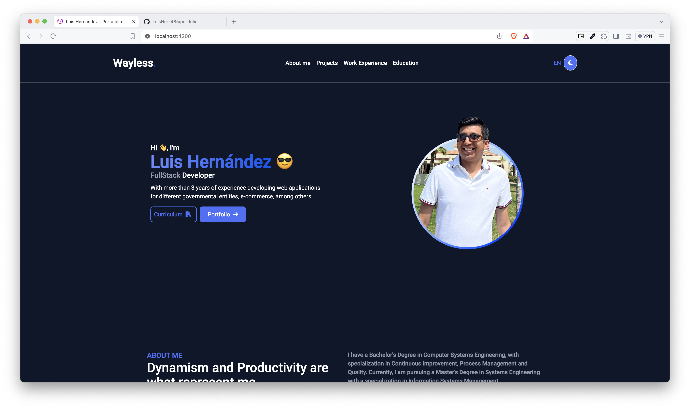

# Portfolio: Wayless (Luis Hernandez)

- [Portfolio: Wayless (Luis Hernandez)](#portfolio-wayless-luis-hernandez) 
    -[Introduccion](#introduccion) 
    -[Requerimientos](#requerimientos) 
    -[Librerias Utilizadas](#librerias-utilizadas) 
    -[Configuracion](#configuracion) 
    -[Ejecucion](#ejecución) 
    -[Preview](#preview) 

## Introduccion
Proyecto desarrollado por Luis Hernandez aka Wayless. Es un portafolio desarrollado con angular acerca de informacion basica acerca de proyectos, y vida laboral del creador.
Este proyecto cuanta con modo oscuro, y la posibilidad de iterar entre el idioma Ingles y Espanol.

## Requerimientos
1. Instalar [Node LTS](https://nodejs.org/es/download).
2. Instalar [Angular Cli 17.2.1](https://angular.io/guide/setup-local)
    - Realizar la instalacion con la terminal con el comando `npm install -global @angular/cli@17.2.1`
3. Instalar [Visual Studio Code](https://code.visualstudio.com/)

## Librerias Utilizadas
1. Angular Material [Angular Material](https://material.angular.io/) 
2. TailwindCSS [Tailwind CSS](https://tailwindcss.com/)
3. Font Awesome Icons [Font Awesome](https://fontawesome.com/)
4. RxJs [RxJs](https://rxjs.dev/guide/overview)
5. Swiper [SwiperJS](https://swiperjs.com/)

## Configuracion
1. Clonar el repositorio localmente.
2. Realizar el `npm install` para poder instalar las dependencias necesarias (si hay un problema con la versión de las dependencias hacer un `npm install --legacy-peer-deps`).

## Ejecución
Para ejecutar por el terminal solo se tiene que hacer el siguiente comando: `ng serve` o `ng serve --open`. Luego de eso se puede abrir un navegador en el puerto http://localhost:4200.

## Preview
Se adjuntan imagenes de previews del portafolio

1. Modo Oscuro desactivado y en idioma espanol
    

2. Modo Oscuro activado y en idioma espanol
    

3. Modo Oscuro desactivado y pagina en idioma ingles
    

